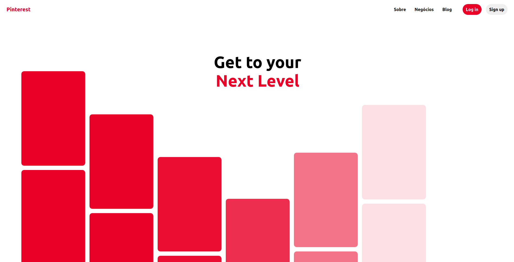

<h1 align="center">
    <span>Ui-Clone</span>
</h1>
<h3 align="center">
    
</h3>

<p align="center">
   <a href="https://github.com/VictorGabrielMS">
    
  </a>
</p>

<p align="center">
  <a href="https://developer.mozilla.org/pt-BR/docs/Web/JavaScript">
    
  </a>
  <a href="https://sass-lang.com/">
    
  </a>
  <a href="https://developer.mozilla.org/pt-BR/docs/Web/HTML">
    
  </a>
</p>

## Ui-Clone Pinterest

- [About](#about)
- [The Application](#application)
- [Techs](#techs)
- [Clone and use for Free](#clone)

<a id="about"></a>

## :interrobang: About

A simple ui clone of the pinterest home page, a simple application to work with sass

<a id="application"></a>

## :sparkles: The Application

<h1 align="center">
    
</h1>


<a id="techs"></a>

## :diamonds: Techs

The project was developed with the technologies below:

- [Javacript](https://developer.mozilla.org/pt-BR/docs/Web/JavaScript)
- [Sass](https://sass-lang.com/)
- [Html](https://developer.mozilla.org/pt-BR/docs/Web/HTML)

<a id="clone"></a>

## :octocat:Clone this repo

1. Clone :

```sh
  $ git clone https://github.com/VictorGabrielMS/ui-clone-pinterest.git
```

2. Execute:

- open in some browser
